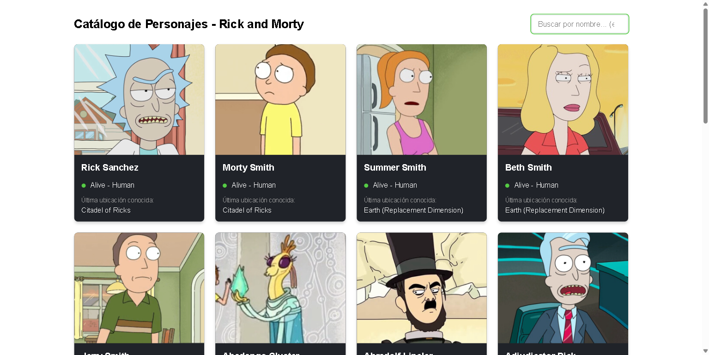

# Taller: Consumo de APIs RESTful en Angular (Rick and Morty)

Implementación de la *Guía de Práctica: Consumo de APIs RESTful en Angular*
sobre **Angular 21.2.22** (standalone + zoneless), consumiendo
`https://rickandmortyapi.com/api/character`.

## Cómo ejecutarlo

```bash
npm install      # solo la primera vez
npm start        # http://localhost:4200
npm test         # 6 pruebas unitarias
npm run build    # compilación de producción
```



## Dónde está cada criterio de la rúbrica

| Criterio (25% c/u) | Archivo |
|---|---|
| Arquitectura & Tipado | `src/app/models/character.model.ts`, `src/app/services/character.service.ts` |
| Consumo HTTP & RxJS | `src/app/app.config.ts` (`provideHttpClient`), `character-list.component.ts` (pipeline + `subscribe`) |
| Manejo de estados en UI | `character-list.component.ts` (`loading`, `errorMessage`, `isEmpty`) y `.html` |
| Plantilla & Rendimiento | `character-list.component.html` (`@for` con `track`, `@if`), `.css` (grid responsivo) |

## Diferencias respecto a la guía (y por qué)

La guía está escrita para Angular 17/18. Este proyecto corre sobre Angular 21 y
hay cuatro cosas que **no** se pueden copiar literalmente:

1. **`provideZoneChangeDetection()` no se usa.** Angular 21 genera proyectos
   *zoneless*: `zone.js` ni siquiera está instalado. Ese proveedor daría error.

2. **El estado son `signal()`, no propiedades normales.** Es consecuencia directa
   de lo anterior: sin Zone.js, asignar `this.characters = [...]` dentro de un
   `subscribe` no avisa a Angular de que hay que repintar, y la pantalla se
   queda en "Cargando..." para siempre. Los signals sí notifican. Es decir, el
   "reto opcional 3" no es opcional en Angular 21: es la única forma de que el
   código de la guía funcione.

3. **No se importa `CommonModule`.** `@if` y `@for` son sintaxis del compilador
   desde Angular 17; `NgIf` y `NgFor` ya no hacen falta.

4. **`standalone: true` se omite** (es el valor por defecto desde Angular 19) y
   `styleUrls: []` se escribe `styleUrl: ''` (un componente, una hoja).

## Retos opcionales implementados

- **1. Paginación dinámica** — `info.pages` alimenta el signal `totalPages`;
  los botones se deshabilitan solos en la primera y la última página.
- **2. Filtro por nombre** — parámetro `?name=` con `debounceTime(300)`, para no
  lanzar una petición por tecla pulsada. Cambiar el filtro reinicia la página a 1.
- **3. Refactor a Signals** — todo el estado es `signal()` / `computed()`, y el
  flujo de RxJS se conecta con `toObservable()` + `takeUntilDestroyed()`.

## Decisiones técnicas que no están en la guía

- **`switchMap` cancela la petición anterior.** Al escribir "rick" se disparan
  varias consultas; sin `switchMap`, si la respuesta de `ri` llega después que la
  de `rick`, la pantalla acaba mostrando resultados que no corresponden a lo que
  hay escrito en el input. Es una condición de carrera real, no teórica.
- **El error se captura dentro del `switchMap`, no en el `error:` del `subscribe`.**
  Si el error sale al observable exterior, este se completa y el componente deja
  de responder a nuevos filtros o cambios de página: la UI queda muerta hasta
  recargar. Por eso hay además un botón "Reintentar".
- **La API responde 404 cuando el filtro no encuentra a nadie.** Eso no es un
  fallo de red: el servicio lo traduce a una lista vacía y la vista muestra
  "No se encontró ningún personaje", no un mensaje de error.
- **`timeout(10_000)` en la llamada.** Sin techo de tiempo, una red colgada deja
  el indicador de carga girando indefinidamente.
- **`track char.id`** permite reutilizar el DOM de las tarjetas entre páginas en
  lugar de destruirlo y recrearlo entero.
- **`provideHttpClient(withFetch())`** usa la Fetch API en lugar de
  `XMLHttpRequest`; es lo recomendado y lo único que funciona bien con SSR.

## Pruebas

`src/app/services/character.service.spec.ts` cubre la construcción de la URL
(página y filtro), la traducción del 404 a lista vacía y la propagación de los
errores reales. `src/app/app.spec.ts` verifica el montaje. Ninguna prueba sale a
internet: usan `provideHttpClientTesting()`.
